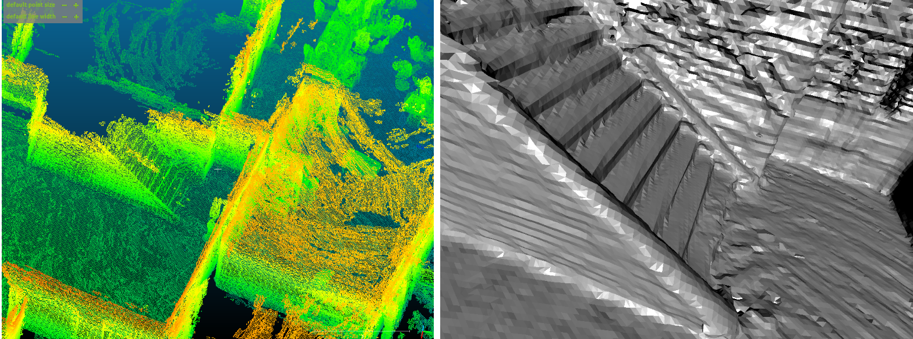

VDBFUSION_ROS_MAPPING
---
This repo is **<u>modified version of vdbfusion</u>** for mapping incrementally based on received odometry and corresponding point cloud message. The whole process is based on the ROS1, please check [origin repo of vdbfusion](https://github.com/PRBonn/vdbfusion) if you'd like to use directly.

```bash
git clone --recurse-submodules https://gitee.com/kin_zhang/vdbfusion_mapping.git
```
## Install

Own environment, please check [the file here](assets/readme/install_desktop.md), TESTED SYSTEM: Ubuntu 18.04 and Ubuntu 20.04

Docker version for convenient  usage. [在内地的同学建议使用docker pull 先换一下dockerhub的源]

```bash
docker pull zhangkin/vdbmapping_mapping

# or build through Dockerfile
docker build -t zhangkin/vdbfusion_mapping .

# =========== RUN
docker run -it --net=host -v /dev/shm:/dev/shm -v /home/kin/bags:/workspace/data --name vdbfusion_mapping zhangkin/vdbfusion_mapping /bin/zsh
```

### Dependencies

Here is some dependencies for desktop installed if you'd like to try. Please follow their dependencies to install, [Dockerfile](Dockerfile) may help you with that.

- [IGL](https://github.com/libigl/libigl): mesh save
- [OpenVDB](https://github.com/nachovizzo/openvdb.git): vdb data structure, ATTENTION Boost need 1.70, Ubuntu 18.04 default is 1.65
- [glog, gflag](https://github.com/google/glog.git): for output log
- [ROS1](http://wiki.ros.org/ROS/Installation): ROS-full (tested on melodic)

## Usage

Please note that this is the for incremental mapping, **no! odom output!** So, you have to **have odom/tf topic with same timestamp** lidar msg. If you don't have the package to do so, checkout here: [Kin-Zhang/simple_ndt_slam](https://github.com/Kin-Zhang/simple_ndt_slam)


### Config

The only thing you have to change is the config file about the topic name on your own dataset/equipment.

```yaml
# input topic name setting ===========> Please change according to your dataset
lidar_topic: "/odom_lidar"
odom_topic: "/auto_odom"
```

### Run

run launch with bag directly

```bash
roslaunch vdbfusion_ros vdbfusion_mapping.launch
```

save and pub map, open with visualization tools example image, .pcd file and .ply file (mesh)
```bash
rosservice call /save_map '/workspace/data/test' 0.0
```


## Acknowledgement

- [PRBonn/vdbfusion](https://github.com/PRBonn/vdbfusion)

- [PRBonn/vdbfusion_ros](https://github.com/PRBonn/vdbfusion_ros)

- Style Formate: [https://github.com/ethz-asl/linter](https://github.com/ethz-asl/linter)

  ```bash
  cd $YOUR_REPO
  init_linter_git_hooks # install
  linter_check_all # run
  
  init_linter_git_hooks --remove # remove
  ```

- [jianhao jiao](https://github.com/gogojjh): for the first version on vdbfusion mapping ros

## Others

Using HDDA can speed up the searching and updating for voxel ray through, but in the real mapping we didn't find a lots of improvements on time.

```bash
[DDA searching active voxel] takes 630.797364 ms
number of active voxels (repeated counted): 2440188
[HDDA searching active voxel: ] takes 305.694895 ms
number of active voxels (repeated counted): 2440154
```

grouped process TODO from voxblox