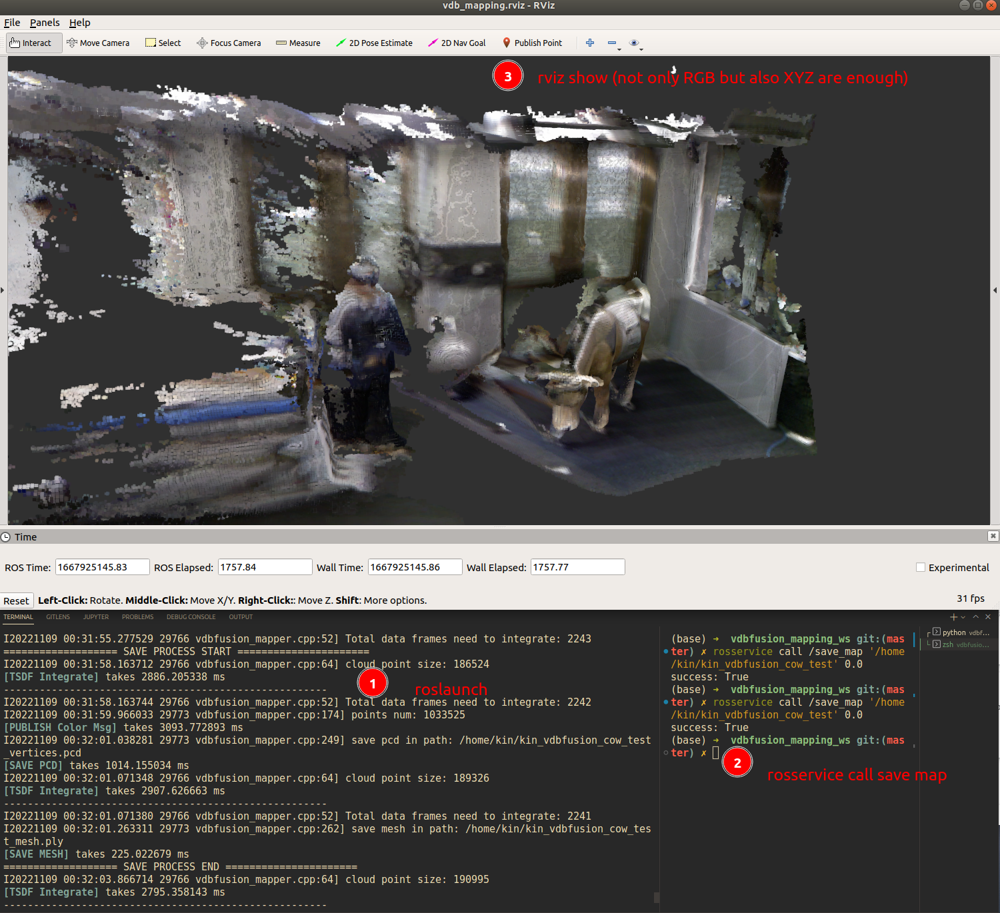
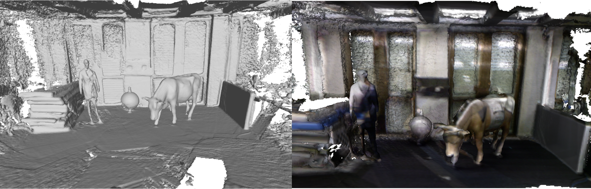
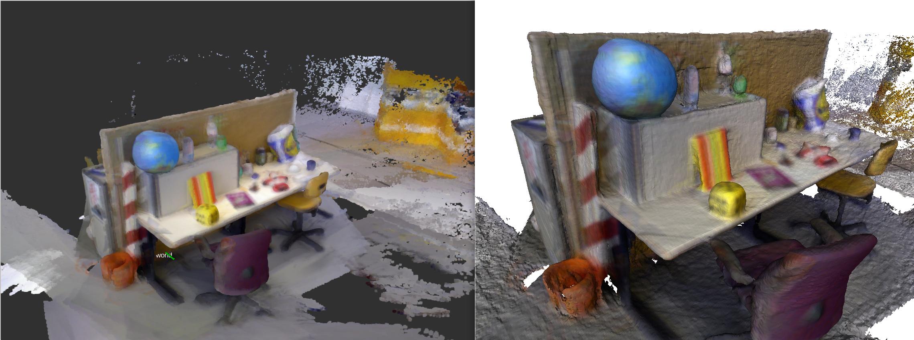

VDBFUSION_ROS_MAPPING
---
This repo is **<u>modified ROS1 version of vdbfusion</u>** for mapping incrementally based on received odometry and corresponding point cloud message. Since the [origin repo of vdbfusion_ros](https://github.com/PRBonn/vdbfusion_ros) have some problems on the cow dataset, more issues can be found [here](https://github.com/PRBonn/vdbfusion_ros/issues/2). The whole process is based on the ROS1, please check [origin repo of vdbfusion](https://github.com/PRBonn/vdbfusion) if you'd like to use directly without ROS. Please remember clone submodules also.

```bash
# 内地的同学用gitee 快一点
git clone --recurse-submodules https://gitee.com/kin_zhang/vdbfusion_mapping.git
# OR from github
git clone --recurse-submodules https://github.com/Kin-Zhang/vdbfusion_mapping.git
```
## Install

Docker version for convenient  usage. [在内地的同学建议使用docker pull 先换一下dockerhub的源]

```bash
docker pull zhangkin/vdbmapping_mapping

# or build through Dockerfile
docker build -t zhangkin/vdbfusion_mapping .

# =========== RUN -v is the bag path in your computer
docker run -it --net=host -v /dev/shm:/dev/shm -v /home/kin/bags:/workspace/data --name vdbfusion_mapping zhangkin/vdbfusion_mapping /bin/zsh
```

### Dependencies

Own environment, please check [the file here](assets/readme/install_desktop.md), TESTED SYSTEM: Ubuntu 18.04 and Ubuntu 20.04. Here are some dependencies for desktop installed if you'd like to try. Please follow their dependencies to install, [Dockerfile](Dockerfile) may help you with that also.

- [IGL](https://github.com/libigl/libigl): mesh save
- [OpenVDB](https://github.com/nachovizzo/openvdb.git): vdb data structure, ATTENTION Boost need 1.70, Ubuntu 18.04 default is 1.65
- [glog, gflag](https://github.com/google/glog.git): for output log
- [ROS1](http://wiki.ros.org/ROS/Installation): ROS-full (tested on melodic)

## Usage

Please note that this is the for incremental mapping, **no! odom output!** So, you have to **have odom/tf topic with same timestamp** lidar msg. If you don't have the package to do so, checkout here: [Kin-Zhang/simple_ndt_slam](https://github.com/Kin-Zhang/simple_ndt_slam) Really easy to get poses!! (But it didn't work well on depth sensor point cloud like cow dataset)


### Config

The only thing you have to change is the config file about the topic name on your own dataset/equipment.

```yaml
# input topic name setting ===========> Please change according to your dataset
lidar_topic: "/odom_lidar"
odom_topic: "/auto_odom"

# or tf topic ==> like the cow and lady dataset
```

### Run

run launch with bag directly

```bash
roslaunch vdbfusion_ros vdbfusion_mapping.launch
```

save and pub map, open with visualization tools example image, .pcd file and .ply file (mesh)
```bash
rosservice call /save_map '/workspace/data/test' 0.0
```

### Results

My own dataset with [Kin-Zhang/simple_ndt_slam](https://github.com/Kin-Zhang/simple_ndt_slam) give the pose and this repo to mapping




[ETH Zurich ASL: Cow and Lady RGBD Dataset](https://projects.asl.ethz.ch/datasets/doku.php?id=iros2017) Meshlab view, If the bag have the RGB info in the msg like XYZRGB etc, the results could be like right one:



Another dataset: [TU Munich RGB-D SLAM Dataset and Benchmark - FR1DESK2](https://vision.in.tum.de/data/datasets/rgbd-dataset) Test bag: `rgbd_dataset_freiburg3_long_office_household-2hz-with-pointclouds.bag`



## Acknowledgement

- [ethz-asl/voxblox](https://github.com/ethz-asl/voxblox)

- [PRBonn/vdbfusion](https://github.com/PRBonn/vdbfusion)

- [PRBonn/vdbfusion_ros](https://github.com/PRBonn/vdbfusion_ros)

- [jianhao jiao](https://github.com/gogojjh): for the first version on vdbfusion mapping ros

- [paucarre](https://github.com/paucarre): for the rgb version on vdbfusion

- Style Formate: [https://github.com/ethz-asl/linter](https://github.com/ethz-asl/linter)

  ```bash
  cd $YOUR_REPO
  init_linter_git_hooks # install
  linter_check_all # run
  
  init_linter_git_hooks --remove # remove
  ```

## Others

includes some todo and issue

- [ ] grouped process TODO from voxblox
- [ ] Memory increases a lot, maybe buffer and thread is not so great option, throw some data away if the queue is too long?
- [ ] speedup again?? GPU? I don't know, let's find out

---

Solved:

- For HDDA, here are comments from vdbfusion author [@nachovizzo](https://github.com/nachovizzo):

  > Additionally, the HDDA makes not much sense in our mapping context since it's highly effective ONCE the VDB topology has been already created